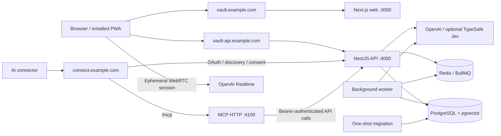
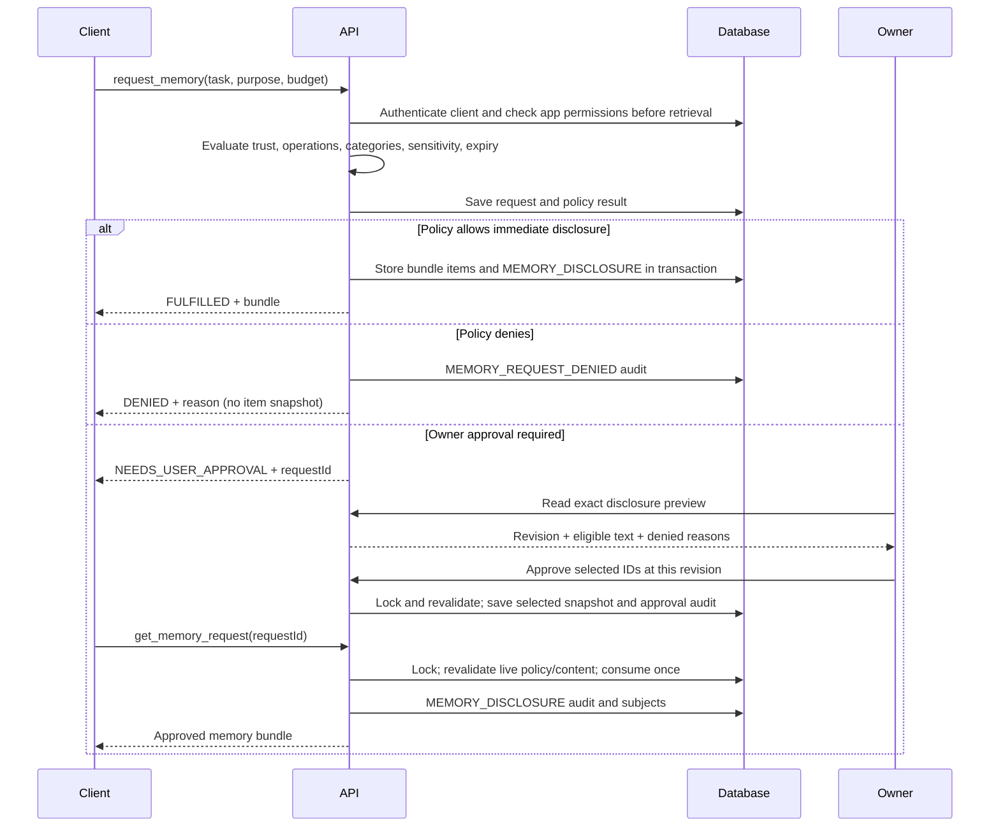
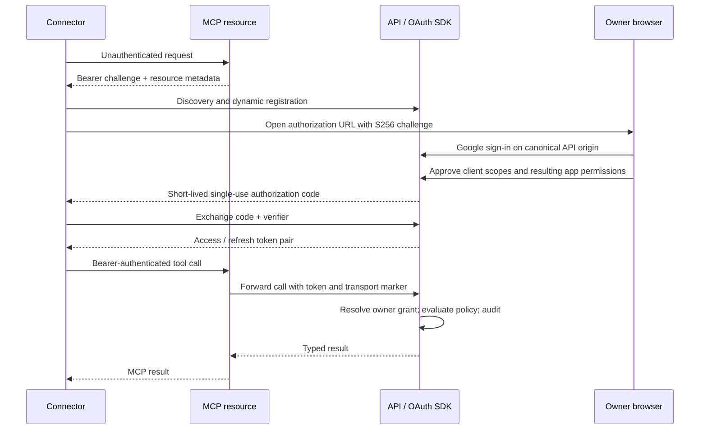
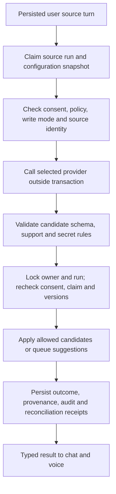

# Architecture

Funes Vault has one authority for identity, policy, memory writes and auditing:
the NestJS API. The web/PWA and MCP server call that authority. PostgreSQL stores
durable state; Redis schedules background work. The server can read stored data.

## Deployment and public routes

`docker-compose.prod.yml` defines postgres, redis, migrate, api, worker, web and
mcp. API and worker use the same runtime image. Caddy is the external reverse
proxy configured by `deploy/Caddyfile`; it is not another service in that compose
file. PostgreSQL and Redis have no published production ports.

| Origin    | Routing                                                                                                                                        |
| --------- | ---------------------------------------------------------------------------------------------------------------------------------------------- |
| Web       | All Next routes and static assets go to web.                                                                                                   |
| API       | Browser `/auth/*`, `/oauth/consent*`, `/v1/*`, discovery and exact `/health` go to API. Readiness and operator routes remain private.          |
| Connector | `/mcp` goes to MCP; OAuth metadata, authorization, token, registration, revocation and consent routes go to API. Unmatched paths are rejected. |

TypeSafe Jev is an optional external memory classifier, separate from OpenAI; its task-specific consent is described in [memory processing](docs/memory-processing.md).

Use HTTPS and configure canonical origins and Google callbacks together. MCP
sessions and rate limits are process-local; run one MCP instance. See the
[operations guide](docs/deployment-and-operations.md) for the precise proxy map.

## API module map

Audit names below describe each module's writes through `AuditTrailService`.
Controllers do not access Prisma directly.

| Module                    | Responsibility and routes                                                                                                                                   | AuditEventType writes                                                                                                         |
| ------------------------- | ----------------------------------------------------------------------------------------------------------------------------------------------------------- | ----------------------------------------------------------------------------------------------------------------------------- |
| `AuthModule`              | Google sign-in, profile, logout, demo and account deletion; `/auth/*`                                                                                       | None                                                                                                                          |
| `SessionsModule`          | Session lookup for guards, OAuth and dashboard; no routes                                                                                                   | None                                                                                                                          |
| `MemoriesModule`          | Owner CRUD/provenance and taxonomy; `/v1/memories`, `/v1/categories`, `/v1/memory-categories`                                                               | `MEMORY_CREATED`, `MEMORY_UPDATED`, `MEMORY_ARCHIVED`, `MEMORY_DELETED`                                                       |
| `ClientsModule`           | Client management and tokens; `/v1/clients`                                                                                                                 | `CLIENT_CREATED`, `CLIENT_UPDATED`, `CLIENT_TOKEN_ROTATED`                                                                    |
| `PoliciesModule`          | Owner policy CRUD and evaluation; `/v1/policies`                                                                                                            | `POLICY_CREATED`, `POLICY_UPDATED`, `POLICY_DELETED`                                                                          |
| `MemoryRequestsModule`    | Client retrieval and owner sharing requests; `/v1/memory-requests`, `/v1/memory-request-reviews`                                                            | `MEMORY_DISCLOSURE`, `MEMORY_REQUEST_APPROVED`, `MEMORY_REQUEST_DENIED`                                                       |
| `MemorySuggestionsModule` | Client/owner suggestions and review; `/v1/memory-suggestions`, `/v1/captures`                                                                               | `MEMORY_SUGGESTION_CREATED`, `MEMORY_SUGGESTION_APPROVED`, `MEMORY_SUGGESTION_REJECTED`, `MEMORY_CREATED`, `MEMORY_ARCHIVED`  |
| `ChatModule`              | Threads, turns, guided questions and streaming; `/v1/chat/*`                                                                                                | None directly; tools delegate to memory/request/suggestion services                                                           |
| `VoiceModule`             | Realtime sessions, turns and tools; `/v1/chat/voice-sessions/*`                                                                                             | None directly; tools delegate to the same domain services                                                                     |
| `MemoryProcessingModule`  | Extraction/reconciliation and source status, retry, reprocess; `/v1/memory-processing/*`                                                                    | `MEMORY_PROCESSING_COMPLETED`; candidate writes delegate to suggestions                                                       |
| `ProcessingCoreModule`    | HTTP-free configuration and processor permission services; no routes                                                                                        | `PROCESSING_CONSENT_UPDATED`                                                                                                  |
| `ConsolidationModule`     | Discovery, provider judgment, proposals and archive application; no routes                                                                                  | `JOB_CREATED`, `JOB_COMPLETED`, `JOB_FAILED`, `MEMORY_ARCHIVED`                                                               |
| `JobsModule`              | Owner jobs and consolidation settings; `/v1/jobs`, `/v1/jobs/consolidation-settings`, `/v1/jobs/consolidation-runs`                                         | None directly; domain runners record jobs                                                                                     |
| `JobsRuntimeModule`       | Queue producers/consumers shared by API and worker; no routes                                                                                               | None directly                                                                                                                 |
| `EmbeddingsModule`        | Sensitivity-gated provider/vector writes and queue; no routes                                                                                               | `JOB_COMPLETED`, `JOB_FAILED`                                                                                                 |
| `FirstPartyAccessModule`  | Create chat/voice clients and policies; no routes                                                                                                           | `CLIENT_CREATED`, `POLICY_CREATED`                                                                                            |
| `OAuthModule`             | Discovery, registration, authorization, consent, tokens and revocation; `/.well-known/*`, `/register`, `/authorize`, `/oauth/consent*`, `/token`, `/revoke` | `OAUTH_GRANT_APPROVED`, `OAUTH_GRANT_DENIED`, `OAUTH_TOKEN_ISSUED`, `OAUTH_TOKEN_REVOKED`, `CLIENT_CREATED`, `POLICY_CREATED` |
| `DataControlModule`       | Owner export and import preview/commit; `/v1/data/export`, `/v1/data/import/preview`, `/v1/data/import`                                                     | `JOB_CREATED`, `JOB_COMPLETED`, `MEMORY_CREATED`, `MEMORY_SUGGESTION_CREATED`; export writes no audit                         |
| `AuditTrailModule`        | Shared event/provenance writer; no routes                                                                                                                   | Persists events requested by domain services                                                                                  |
| `AuditModule`             | Owner event reads; `/v1/audit-events`                                                                                                                       | None                                                                                                                          |
| `OverviewModule`          | Owner aggregates; `/v1/overview`                                                                                                                            | None                                                                                                                          |
| `HealthModule`            | `/health`, `/health/live`, `/health/ready`                                                                                                                  | None                                                                                                                          |
| `PrismaModule`            | Database lifecycle; no routes                                                                                                                               | None                                                                                                                          |

`PrismaModule` is global and is registered once at each process root; feature modules inject its service without redundant imports.

`AppModule` composes HTTP modules. `WorkerModule` composes queue and processing
modules without importing HTTP controllers. Larger use cases separate orchestration,
repositories, transaction writers and response mappers. Database ownership and
relationships are documented in the [schema reference](docs/database-schema.md).

## One-time disclosure

Approval is bound to the requesting client, revision and selected memories. Policy,
client, content or sensitivity changes can invalidate it. Approval never expands
the original request ceiling. Retrieval expiry, tenant checks and a transactional
claim prevent replay and concurrent double delivery. Denied memories are excluded;
revocation cannot retract text already received by a client.

## MCP OAuth connector

Opaque tokens and codes are hashed at rest. Refresh rotates the pair; reuse and
revocation checks are database-backed. Google tokens are not retained. The Google
PKCE verifier is an explicit short-lived exception because exchange needs its
plaintext value; login-attempt cleanup and expiry bound its lifetime.

## Extraction and consolidation

Extraction and consolidation choose providers independently for each owner. System 2 is the
OpenAI LLM pipeline. System 1 uses the TypeSafe Jev classifier; extraction also
uses OpenAI normalization. These configuration names are defined in the
[processing guide](docs/memory-processing.md). No automatic provider fallback
occurs. Expired claims and late provider results cannot write after cancellation
or a provider switch. Retries retain the original configuration snapshot unless
an explicit, audited reprocess is allowed.

Consolidation gathers bounded candidates, separates deterministic maintenance from
provider work, and rechecks memory versions before archival. User-visible changes
advance `consolidationRelevantAt`; maintenance does not masquerade as a new edit.
Default consolidation is disabled and review-only. Explicit automatic mode still
uses the same version, policy and audit checks.

## Web state and build model

Next route files render their own features. Shared layouts own API/query providers,
authentication, navigation and the single main landmark. TanStack Query owns
server data; local component state owns forms and selection. Keys include the API
origin, mutations invalidate affected domains, and owner transitions remove private
cached data. Chat streaming defers newly created thread navigation until completion
so the active stream is preserved. Voice controllers bind to one thread per session
and release microphone, peer connection and data channel on every exit path.

Shared contracts are split by domain and exported through package subpaths. Node-only
token hashing has a separate entry point. TypeScript project references build
shared/db/MCP declarations before consumers; package exports point at `dist`.
`pnpm typecheck` generates Prisma and Next route types, then runs `tsc -b`.
`pnpm dev` builds workspace packages before starting watchers. Production builds
exclude tests and ship only each runtime's dependencies. Docker runs as `node`.

Feature CSS is imported by its owner, with responsive rules alongside it. Shared
primitives use design tokens. See [style conventions](apps/web/src/styles/README.md).
The service worker caches versioned shell resources, never API responses; explicit
offline captures use a device-local queue.

## Verification

The [testing guide](docs/testing-and-release.md) is the source of truth for the
pyramid: pure/unit checks, PostgreSQL integration, the privacy umbrella, production
browser smoke, development demo login and separately opted-in live voice. The
checked-in OpenAPI document comes from the same factory used by the running API;
CI rejects unreviewed drift. The ER diagram is generated from Prisma.

TypeSafe is the optional external provider of the Jev memory classifier. `TYPESAFE_API_KEY` configures that service; it is not a TypeScript type-safety feature. Provider selection and environment compatibility are recorded in [ADR 0037](docs/adr/0037-configurable-memory-processing.md).
