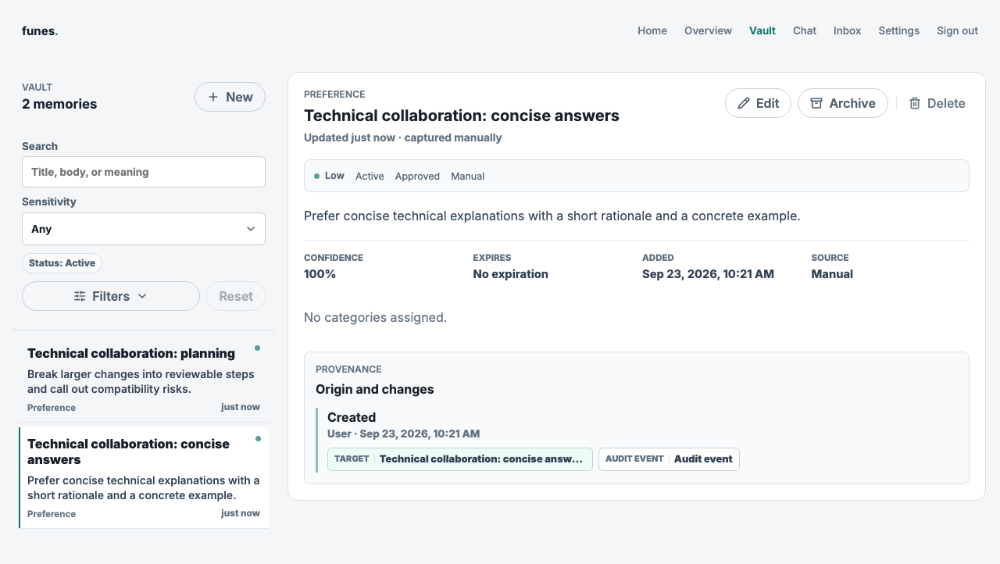
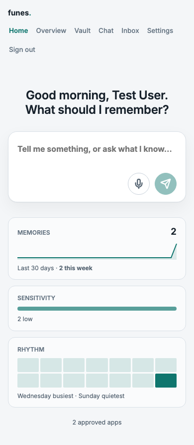
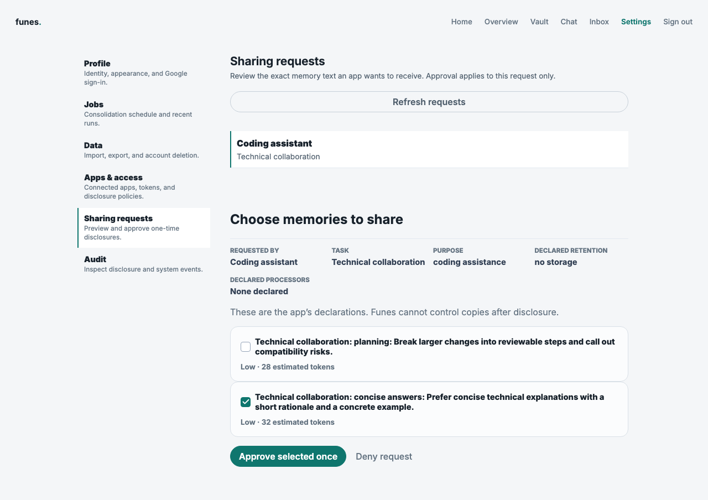
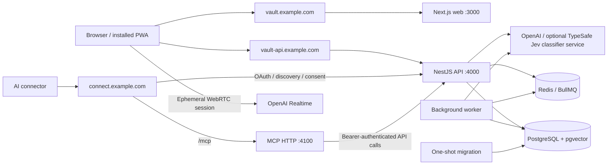

# Funes Vault

Funes Vault is a self-hosted personal memory vault for AI tools. Keep durable context in one place, decide what each tool may receive, review exact disclosures, and inspect the audit trail. AI conversations repeatedly lose useful context, while copying everything into every tool gives away too much. Funes makes memory portable and sharing deliberate.[^name]

[](https://github.com/bereciartua/funes-vault/actions/workflows/ci.yml)
[](LICENSE)
[](.nvmrc)

| Your memory vault                                                                                        | On your phone                                                                       |
| -------------------------------------------------------------------------------------------------------- | ----------------------------------------------------------------------------------- |
|  |  |
| Inspect, correct and organize your context.                                                              | Install the PWA or use a browser.                                                   |


_Approve selected memories once, with the receiving client and its declared retention visible. All screenshots use synthetic data._

## Quickstart

Install **Node 24**, **pnpm 11** (the exact version is in `package.json`) and **Docker**. No provider credentials are required to explore the seeded vault.

```sh
git clone https://github.com/bereciartua/funes-vault.git
cd funes-vault
cp .env.example .env
docker compose up -d
pnpm install
pnpm db:generate
pnpm db:migrate
pnpm db:seed
pnpm dev
```

Open [localhost:3000](http://localhost:3000), choose **Sign in**, then **Use demo account**. The demo account is available only in development after seeding. For your own account, configure [Google sign-in](docs/google-sign-in.md). Chat, embeddings and voice require provider credentials; the vault, policies and review interfaces work without them.

## How it works

The API owns identity, policy and audit decisions. Web and MCP clients use that same boundary; a background worker performs queued processing.



- **Next.js / React**: route-based web interface and installable progressive web app (PWA).
- **NestJS**: authenticated API, shared Zod contracts and generated OpenAPI documentation.
- **Prisma / PostgreSQL / pgvector**: owned records, transactions and semantic retrieval.
- **Redis / BullMQ**: embedding and consolidation jobs.
- **Vercel AI SDK / OpenAI Realtime**: text chat and browser voice sessions.
- **MCP SDK**: Model Context Protocol tools over stdio or Streamable HTTP, with OAuth.
- **Caddy**: HTTPS and separate web, API and connector origins.

See [architecture](ARCHITECTURE.md) for module boundaries and request sequences, and the [glossary](docs/glossary.md) for product terminology.

## Repository layout

```text
apps/api/       Nest API, worker, integration tests and provider adapters
apps/web/       Next routes, feature components, query hooks and shared UI
packages/shared/ Browser-safe Zod contracts and inferred domain types
packages/db/    Prisma schema, baseline migration, generated client and seed
packages/mcp/   MCP tools, HTTP/stdio transports and example client
e2e/            Production-browser smoke tests with a synthetic API harness
e2e-demo/       Development-only seeded demo login tests
e2e-live/       Explicitly opted-in live voice checks
docs/           Operator/integrator guides, OpenAPI, schema and ADRs
deploy/         Reverse-proxy configuration
scripts/        Build, migration, icon and publishing helpers
```

## Features

- Categorized memories with sensitivity, expiration, review state and provenance.
- Quick capture, suggestions inbox and reversible review workflows.
- App permissions per authenticated client, selected disclosure approval and one-time retrieval.
- Revocable client tokens and OAuth connectors, with five MCP tools.
- Chat and voice with citations, visible processing permissions and persisted transcripts.
- Optional extraction and consolidation, disabled or review-first by default.
- Audit history, portable export/import, profile and account controls.
- Responsive light/dark UI, installable PWA and offline text-capture queue. Sign in once on the device to enable cold-start capture for that vault owner; syncing requires the same owner’s valid session.

## Privacy guarantees are tested

| Guarantee                                                            | Evidence                                                                                                                   |
| -------------------------------------------------------------------- | -------------------------------------------------------------------------------------------------------------------------- |
| One owner's identifiers cannot expose another owner's records        | [Tenant isolation](apps/api/test/tenant-isolation.e2e.spec.ts): foreign records return 404.                                |
| Approval discloses only the selected, current text once              | [Disclosure review](apps/api/test/disclosure-review.e2e.spec.ts): stale previews, races and repeat retrieval are rejected. |
| OAuth credentials cannot be replayed after consumption or revocation | [OAuth integration](apps/api/test/oauth.e2e.spec.ts): PKCE, rotation and replay checks.                                    |
| Late processor output cannot bypass revoked permission               | [Processing integration](apps/api/test/memory-processing.e2e.spec.ts): authority is checked again before commit.           |
| Exports and imports cannot transplant working credentials            | [Data control](apps/api/test/data-control.e2e.spec.ts): round trips preserve data while excluding secrets and grants.      |

Read the [privacy model](docs/privacy-and-trust-model.md) and [threat model](docs/threat-model.md) before storing personal data.

## Status and limitations

Version **1.1.0** targets a self-hosted, single-instance deployment. Data is server-readable; this is not end-to-end encryption. OpenAI is the default chat, embedding and voice provider, with pluggable memory-extraction adapters and explicit processing settings. Already-disclosed text is beyond the vault's control. Browser checks do not replace physical-device microphone/PWA validation. See [release notes](CHANGELOG.md).

## Deploying

Use the canonical production Compose file with pinned image tags and three HTTPS origins. Configure Google sign-in and provider permissions, then verify readiness and backups. Follow [deployment and operations](docs/deployment-and-operations.md), including the baseline database upgrade requirement.

## Connecting an AI tool

Create a client and App permissions under **Settings → Apps & access**, or authorize an OAuth connector. Follow [MCP integration](docs/mcp-integration.md); HTTP consumers can use the [API guide](docs/api-guide.md) and [OpenAPI specification](docs/openapi.json).

## Contributing, security and license

Read [CONTRIBUTING.md](CONTRIBUTING.md), the [Code of Conduct](CODE_OF_CONDUCT.md) and [documentation index](docs/README.md). Report vulnerabilities privately through [SECURITY.md](SECURITY.md). Licensed under [Apache 2.0](LICENSE); copyright Martin Bereciartua.

[^name]: The name refers to Jorge Luis Borges's “Funes the Memorious,” a story about extraordinary memory. The interface uses the short wordmark **funes.**; the project is **Funes Vault**.

TypeSafe supplies the optional Jev classifier used by selected memory-processing pipelines. It is an external processor configured with `TYPESAFE_API_KEY`; see [memory processing](docs/memory-processing.md).
